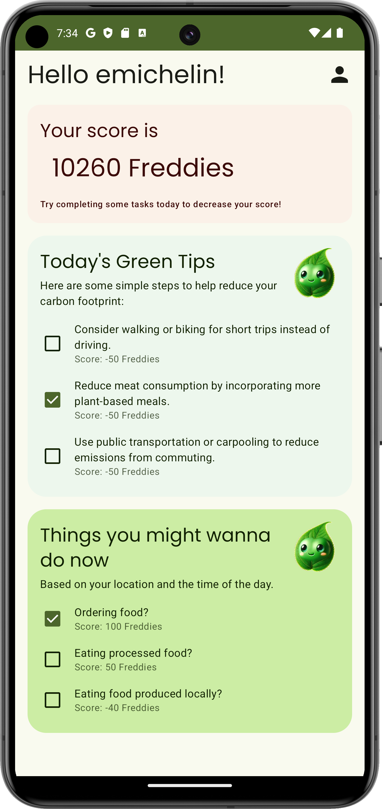

# Fred: Your Personal Carbon **F**ootprint **Red**ucer

---

## Context

Fred was developed during the 24-hour LauzHack Hackathon, that took place at the EPFL BC building in November 2024.

## The app

###  Short description

Fred is your AI-powered companion for a greener lifestyle, guiding you to reduce your carbon footprint with ease and insight. It helps you:
1. Log activities that either reward sustainable habits or track areas for improvement.
2. Receive personalized daily tips to reduce your carbon footprint based on your habits and recent activities.

### Technical details

Fred is an Android application developed in Kotlin using Jetpack Compose. It follows the MVVM architecture and leverages:
- **Firebase** for cloud services such as authentication and data storage.
- **OpenAI's GPT-3.5** for generating tailored recommendations.
- **Nominatim** for geocoding.

